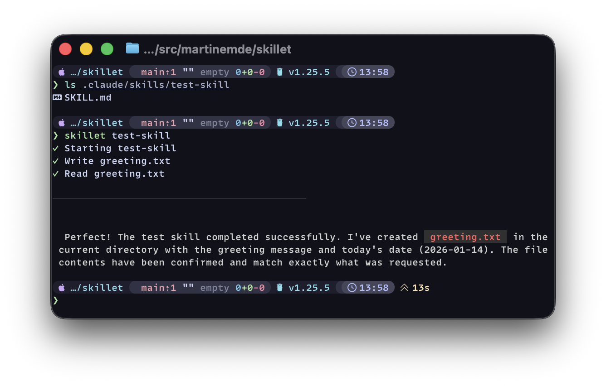

<div align="center">



# Skillet

### Run [Agent SKILL.md](https://agentskills.io) files as shell commands with Claude Code

[](https://github.com/martinemde/skillet/releases)
[](https://go.dev/)
[](https://goreportcard.com/report/github.com/martinemde/skillet)
[](LICENSE)
[](https://github.com/martinemde/skillet/actions)

</div>

---

## Installation

### Download pre-built binaries

Download the latest release for your platform from the [releases page](https://github.com/martinemde/skillet/releases):

```bash
# macOS (Apple Silicon)
curl -L https://github.com/martinemde/skillet/releases/download/v0.1.0/skillet_Darwin_arm64.tar.gz | tar xz
# Linux (x86_64)
curl -L https://github.com/martinemde/skillet/releases/download/v0.1.0/skillet_Linux_x86_64.tar.gz | tar xz

# Move to your PATH (ensure this is in path)
mv skillet ~/.local/bin/
```

### Install with Go

```bash
go install github.com/martinemde/skillet/cmd/skillet@latest
```

### Build from source

```bash
git clone https://github.com/martinemde/skillet.git
cd skillet
go build -o skillet ./cmd/skillet
```

## Usage

```bash
# Direct file path
skillet path/to/SKILL.md

# Directory (automatically finds SKILL.md)
skillet path/to/skill-directory

# Skill name shortcut (looks in .claude/skills/<name>/SKILL.md)
skillet write-skill

# Remote URL
skillet https://raw.githubusercontent.com/user/repo/main/skill.md
```

> [!NOTICE]
> **Skills can be a security risk.** Skills can execute commands, exfiltrate data, and modify files. Only use skills from sources you trust.

## Command-line Options

| Flag        | Description                                                         |
| ----------- | ------------------------------------------------------------------- |
| `--help`    | Show help message                                                   |
| `--version` | Show version information                                            |
| `--verbose` | Show verbose output including raw JSON stream                       |
| `--usage`   | Show token usage statistics after execution                         |
| `--dry-run` | Show the command that would be executed without running it          |
| `--prompt`  | Optional prompt to pass to Claude (default: uses skill description) |

## SKILL.md Format

A SKILL.md file must contain YAML frontmatter followed by markdown content:

```yaml
---
name: skill-name
description: What this skill does and when to use it
allowed-tools: Read,Write,Bash
model: claude-opus-4-5-20251101
---
# Skill Instructions

Your skill instructions go here...
```

### Frontmatter Fields

| Field                      | Required | Description                                         |
| -------------------------- | -------- | --------------------------------------------------- |
| `name`                     | Yes      | Skill name (lowercase, hyphens only, max 64 chars)  |
| `description`              | Yes      | Description of what the skill does (max 1024 chars) |
| `allowed-tools`            | No       | Space-delimited list of pre-approved tools          |
| `model`                    | No       | Claude model to use (defaults to current model)     |
| `license`                  | No       | License information                                 |
| `compatibility`            | No       | Environment requirements (max 500 chars)            |
| `metadata`                 | No       | Additional key-value metadata                       |
| `version`                  | No       | Skill version                                       |
| `disable-model-invocation` | No       | Prevent automatic invocation                        |
| `mode`                     | No       | Mark as a mode command                              |

### Variable Interpolation

Skillet automatically expands the following variables:

- `{baseDir}` - Absolute path to the directory containing SKILL.md

Example:

```markdown
Read configuration from {baseDir}/config.json
```

Becomes:

```markdown
Read configuration from /absolute/path/to/skill/config.json
```

## Testing

Run all tests:

```bash
go test -v ./...
```

## Examples

### Review Skill

```yaml
---
name: code-reviewer
description: Expert code reviewer. Use after making code changes.
allowed-tools: Read Grep Glob Bash(git:*)
model: claude-opus-4-5-20251101
license: Apache-2.0
metadata:
  author: example-org
  version: "1.0.0"
---

# Code Reviewer

Reviews code for quality, security, and best practices.

## Instructions

1. Read the code changes using Read and Grep
2. Analyze for potential issues
3. Provide detailed feedback
```

### With Variable Interpolation

```yaml
---
name: data-processor
description: Processes data files. Use for data analysis tasks.
allowed-tools: Read Write Bash
---

# Data Processor

Process data files from the skill directory.

## Setup

1. Read configuration from {baseDir}/config.json
2. Load data from {baseDir}/data/input.csv
3. Write output to {baseDir}/data/output.csv
```

## Requirements

- Go 1.21 or later
- Claude CLI installed and configured

## Contributing

Contributions are welcome! Please ensure:

1. All tests pass: `go test ./...`
2. Code follows Go conventions: `go fmt ./...`
3. New features include tests
4. Documentation is updated

## License

See LICENSE file for details.

## References

- [Agent Skills Specification](https://agentskills.io)
- [Claude CLI Documentation](https://code.claude.com/docs)
